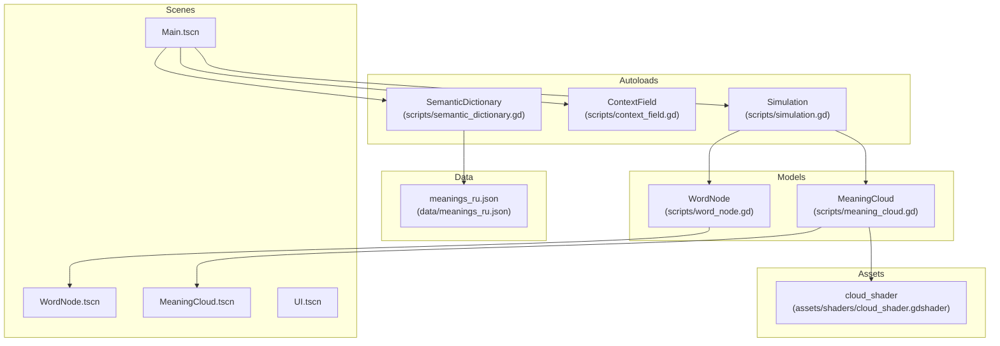
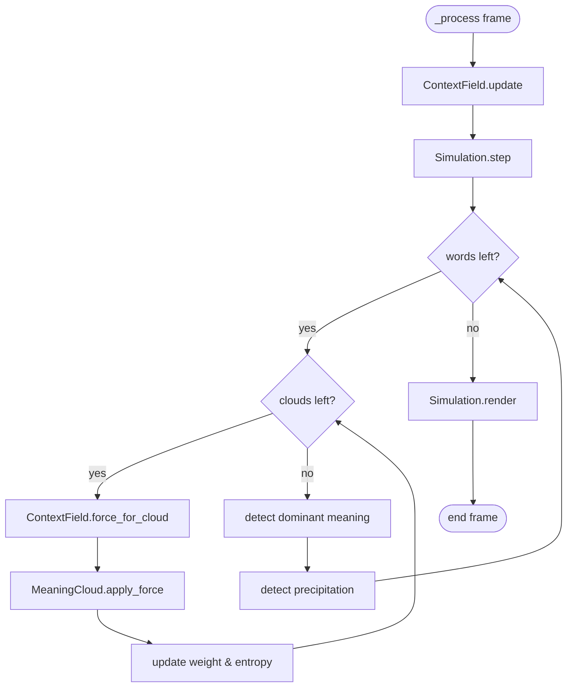
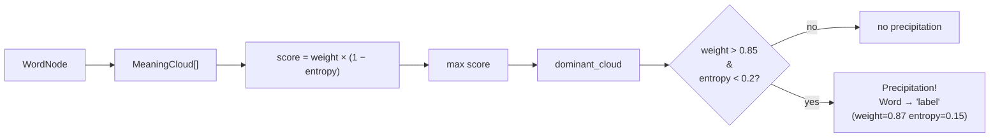
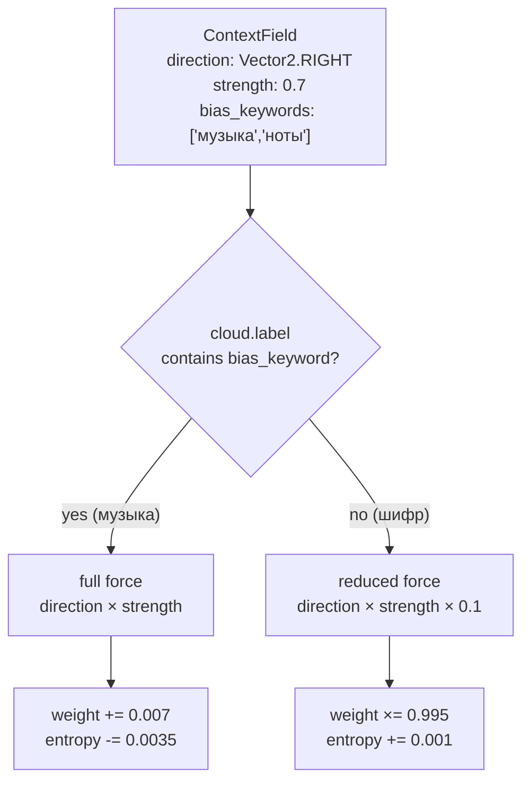

<!-- Generated by doc-superpowers | 2026-05-25 | commit: 7620faa -->

# Architecture Diagrams

## System Overview

## Simulation Step (per frame)

## Dominant Meaning Detection

## Context Wind Effect

