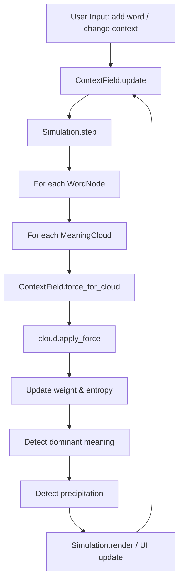
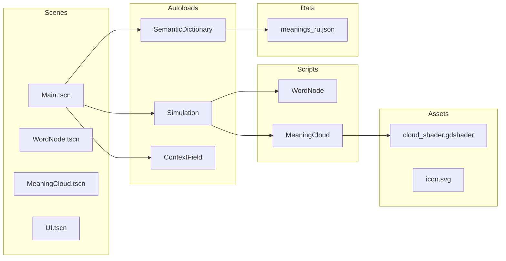

<!-- Generated by doc-superpowers | 2026-05-25 | commit: 7620faa -->

# SOS Semantic Cloud MVP — System Overview

## Purpose

Интерактивный 2D-симулятор дрейфа смыслов. Система превращает слова в динамические облака значений и показывает, как контекст изменяет их распределение в семантическом пространстве.

**Короткая формула:** `Word → MeaningClouds → ContextWind → Drift → DominantMeaning`

## Tech Stack

| Компонент | Технология |
|---|---|
| Движок | Godot 4.3 |
| Язык | GDScript |
| Рендеринг | 2D (CanvasItem), кастомный CanvasItem-шейдер |
| Данные | JSON (встроенный словарь значений) |
| Разрешение | 1920×1080, режим растяжения `canvas_items` + `keep` |

## Core Loop

## Architecture Diagram

## Key Design Decisions

1. **Автозагрузки вместо dependency injection** — `Simulation`, `SemanticDictionary`, `ContextField` зарегистрированы как синглтоны в `project.godot`. Упрощает доступ из любой точки.
2. **RefCounted для модельных классов** — `WordNode` и `MeaningCloud` не наследуют `Node`, а используют `RefCounted`. Сцены `WordNode.tscn` и `MeaningCloud.tscn` — это визуальные представления, отделённые от логики.
3. **JSON как источник данных** — вместо LLM или embedding-поиска. Снижает сложность MVP, позволяет быстро итерировать.
4. **Разделение логики и представления** — `WordNode` (логика) и `WordNode.tscn` (визуализация) — разные сущности. Сцены могут быть созданы/удалены динамически.

## Constraints (v0.1)

- Контекст — один, без многослойности
- Словарь значений — статический JSON, не дополняется во время симуляции
- Нет 3D, социальных полей, рельефа (ямы/болота/горы)
- Нет LLM-запросов в рантайме