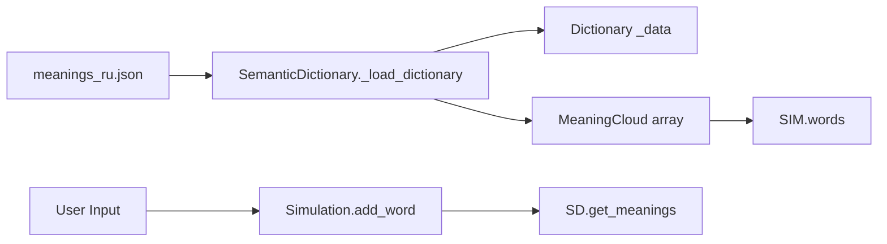

<!-- Generated by doc-superpowers | 2026-05-25 | commit: 7620faa -->

# Data Layer

## Data Source

- **Файл:** `data/meanings_ru.json`
- **Загрузчик:** `SemanticDictionary` (autoload)
- **Формат:** JSON — `Dictionary<String, Array<MeaningEntry>>`
- **Словарь:** 10 слов, 40 значений (см. `SemanticDictionary` для полного списка)

## MeaningEntry Schema

```json
{
    "label": "string",        // название значения
    "type": "string",         // practical | abstract | conflict | metaphor | technical | neutral
    "weight": "float",        // начальный вес (0.0–1.0)
    "entropy": "float",       // начальная энтропия (0.0–1.0)
    "keywords": ["string"]    // ассоциированные ключевые слова
}
```

## Data Flow



## Type Distribution (40 entries)

| Тип | Количество | Цвет |
|---|---|---|
| `abstract` | 9 | 🔵 синий |
| `practical` | 8 | 🟢 зелёный |
| `metaphor` | 8 | 🟣 фиолетовый |
| `technical` | 7 | 🟡 жёлтый |
| `conflict` | 3 | 🔴 красный |
| `neutral` | 1 | ⚪ белый |

## Roadmap

- **v0.2:** Генерация значений через LLM
- **v0.3:** Embedding-поиск для автоматического расположения облаков
- **v0.4:** Динамическое расширение словаря во время симуляции