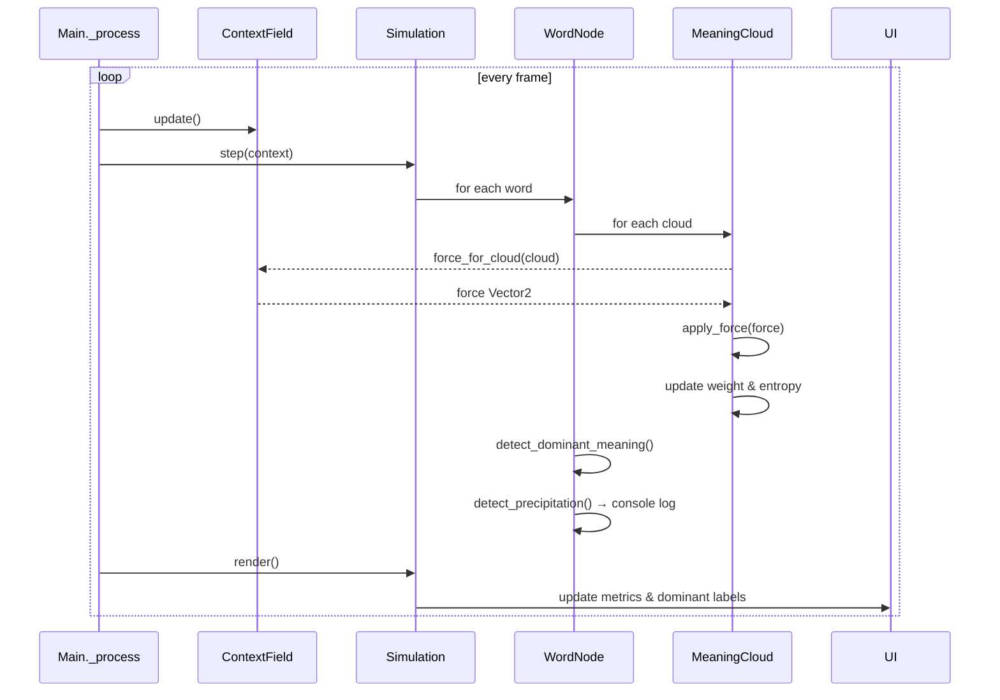
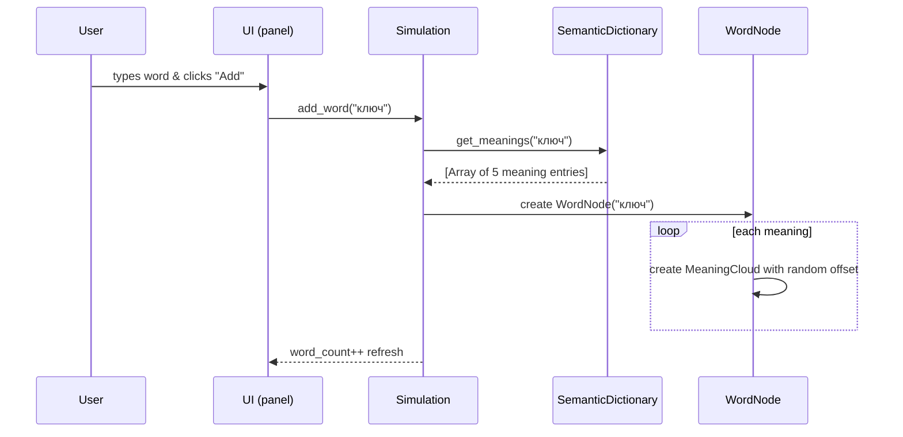
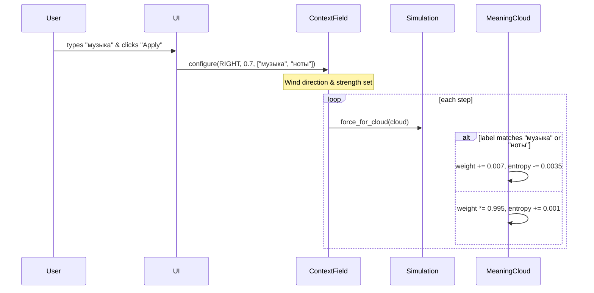

<!-- Generated by doc-superpowers | 2026-05-25 | commit: 7620faa -->

# Simulation Loop

## Main Cycle

```mermaid
sequenceDiagram
    participant Main as Main._process
    participant CF as ContextField
    participant SIM as Simulation
    participant WN as WordNode
    participant MC as MeaningCloud
    participant UI as UI

    loop every frame
        Main->>CF: update()
        Main->>SIM: step(context)
        SIM->>WN: for each word
        WN->>MC: for each cloud
        MC-->>CF: force_for_cloud(cloud)
        CF-->>MC: force Vector2
        MC->>MC: apply_force(force)
        MC->>MC: update weight & entropy
        WN->>WN: detect_dominant_meaning()
        WN->>WN: detect_precipitation() → console log
        Main->>SIM: render()
        SIM->>UI: update metrics & dominant labels
    end
```

## Event Flow: Add Word

```mermaid
sequenceDiagram
    participant User
    participant UI as UI (panel)
    participant SIM as Simulation
    participant SD as SemanticDictionary
    participant WN as WordNode

    User->>UI: types word & clicks "Add"
    UI->>SIM: add_word("ключ")
    SIM->>SD: get_meanings("ключ")
    SD-->>SIM: [Array of 5 meaning entries]
    SIM->>WN: create WordNode("ключ")
    loop each meaning
        WN->>WN: create MeaningCloud with random offset
    end
    SIM-->>UI: word_count++ refresh
```

## Event Flow: Context Change

```mermaid
sequenceDiagram
    participant User
    participant UI
    participant CF as ContextField
    participant SIM as Simulation
    participant MC as MeaningCloud

    User->>UI: types "музыка" & clicks "Apply"
    UI->>CF: configure(RIGHT, 0.7, ["музыка", "ноты"])
    Note over CF: Wind direction & strength set
    loop each step
        CF->>SIM: force_for_cloud(cloud)
        alt label matches "музыка" or "ноты"
            MC->>MC: weight += 0.007, entropy -= 0.0035
        else
            MC->>MC: weight *= 0.995, entropy += 0.001
        end
    end
```